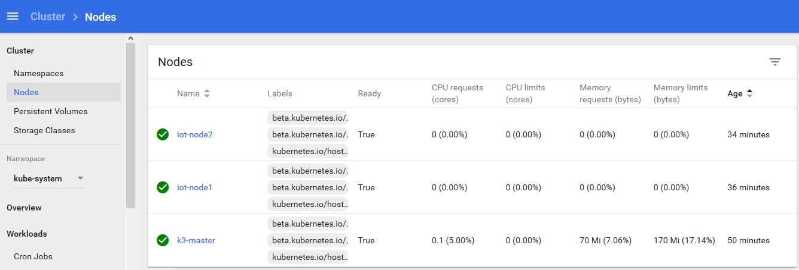

#### To start the application
```bash
Vagrant up
```
#### Configure k3 master
```bash
Vagrant ssh k3-master
sudo service k3s restart
```
#### Configure nodes
Login to each node 
```bash
Vagrant ssh iot-node1 / iot-node2.
```
Run command on each nodes 
```bash
k3s agent --server https://[k3-master-ip]:6443 --token ${NODE_TOKEN}
```
Where NODE_TOKEN comes from /var/lib/rancher/k3s/server/node-token from k3-master

#### Configure dashboard
```bash
Vagrant ssh k3-master 
k3s kubectl -n kube-system get service kubernetes-dashboard
```
Dashboard has been exposed on port 3***** (HTTPS). Now you can access it from your browser at:https://[k3-master-ip]:3*****
To get the token for login
```bash
kubectl get secret -n kube-system $(kubectl get serviceaccount kubernetes-dashboard -n kube-system -o jsonpath="{.secrets[0].name}") -o jsonpath="{.data.token}" | base64 --decode 
```
Dashboard screenshot


